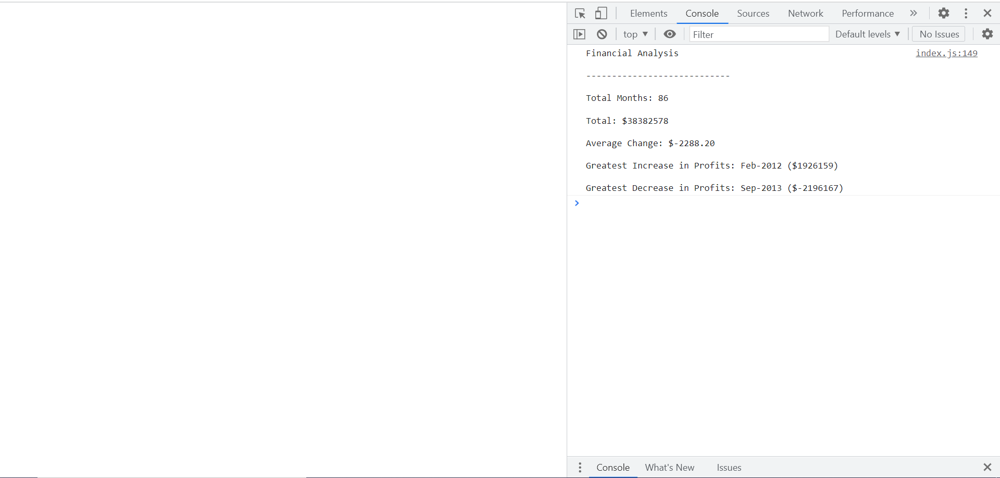

# Console Finances

Trilogy Bootcamp Module 4 Challenge - Console Finances

## Description 

This project analyses the financial records of a company. The code calculates:
- The length of the recorded period in months
- The total profit received by the company over the entire period
- The average change in profit/loss over the period
- The greatest increase in profit over the period
- The greatest decrease in profit over the period

## Table of Contents

* [Installation](#installation)
* [Usage](#usage)
* [License](#license)

## Installation

N/A

## Usage 

Access website at https://sulaiman-ai.github.io/Console-Finances/

1. Open the Chrome Developer Tools by either:
    - Using the shortcut "CTRL + SHIFT + I" or,
    - By right clicking anywhere on the page and in the menu, click "Inspect".
2. Select the "Console" tab

## License

Please refer to the license in the repo.